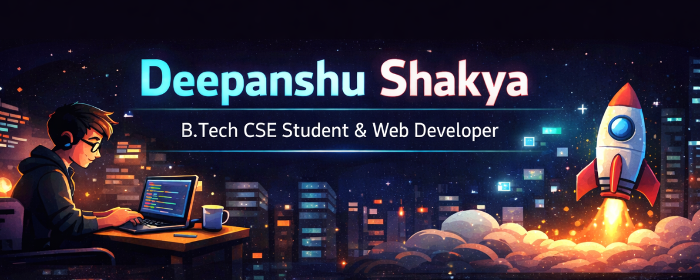

# Hi 👋, I am Deepanshu Shakya
### B.Tech Computer Science Student | Web Developer | Cloud & DevOps Learner

---

## 🚀 About Me
- 🎓 B.Tech CSE Student
- 💻 Passionate Web Developer
- ☁️ Learning Cloud Computing & DevOps
- 📫 Reach me at: deepanshushakya2003@gmail.com

---

## 🛠️ Skills
- HTML, CSS, JavaScript
- React.js
- Node.js
- MongoDB
- Git & GitHub
- Cloud Basics (AWS / Azure)

---

## 💼 Projects
### 🔹 LearnSphere (Online Learning Platform)
- Authentication System
- Admin & User Dashboard
- CRUD Operations
- Responsive UI

### 🔹 Recipe Blog Website
- Add / Delete Recipes
- Dynamic Card Layout
- Attractive UI Design

---

## 📊 GitHub Stats

(Stats images yaha add karenge)

---

## 🌐 Connect with Me
https://www.linkedin.com/in/deepanshu-shakya-5557632a1/ | deepanshushakya2003@gmail.com | Portfolio
